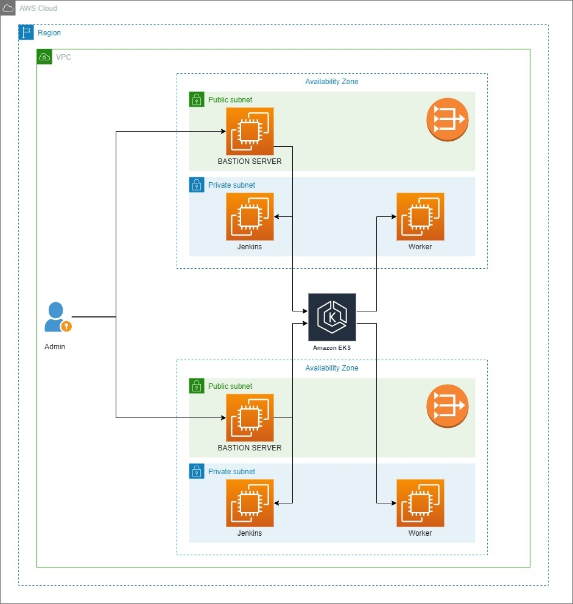

                                                           #Arquitectura General




## Repos usados

➡️ App (forked) > https://github.com/bartodes/app-devops-bootcamp

➡️ ArgoCD > https://github.com/bartodes/k8s-devops-bootcamp


# Jenkins

En este apartado tenemos lo siguiente:


🔎  Docker-compose.yml >> Docker Compose es una herramienta que se utiliza para definir y ejecutar aplicaciones Docker de múltiples contenedores. El archivo docker-compose.yml es un archivo de configuración YAML que define cómo se deben configurar, construir y ejecutar los contenedores de la aplicación. Este archivo es esencial para que Docker Compose pueda automatizar la creación y gestión de contenedores de una aplicación


Para el docker-compose.yml que usamos en el proyecto se creo dos servicios: Docker & Jenkins, Se agrego los ports correspondiente para cada servicio y además se creo los volumenes necesario, por ultimo, se linkeo la network para que tenga comunicación entre ambos servicios.


>> Algunos comandos más usado para esta herramienta
````command
- docker-compose up: Inicia los contenedores definidos en el archivo docker-compose.yml. Si los contenedores no existen, se construyen automáticamente.
- docker-compose down: Detiene y elimina los contenedores definidos en el archivo docker-compose.yml. Si los contenedores no están en ejecución, no hacen nada.
- docker-compose build: Construye o reconstruye los contenedores definidos en el archivo docker-compose.yml.
- docker-compose logs: Muestra los logs de los contenedores definidos en el archivo docker-compose.yml.
- docker-compose ps: Lista los contenedores definidos en el archivo docker-compose.yml y su estado actual.
- docker-compose start: Inicia los contenedores definidos en el archivo docker-compose.yml.
- docker-compose stop: Detiene los contenedores definidos en el archivo docker-compose.yml.
- docker-compose restart: Reinicia los contenedores definidos en el archivo docker-compose.yml.
- docker-compose exec: Ejecuta un comando en un contenedor definido en el archivo docker-compose.yml.
- docker-compose up --build: Inicia los contenedores y los construye si es necesario.
````

🔎  Dockerfile >> El  Dockerfile es una herramienta esencial para la automatización de la construcción y despliegue de aplicaciones en un proyecto de DevOps. Permiten crear imágenes de contenedores consistentes y portátiles que se pueden utilizar para ejecutar la aplicación de manera aislada en cualquier entorno de Docker


Este archivo Dockerfile comienza con la imagen base de Jenkins versión 2.387.1. Luego cambia al usuario root y ejecuta una serie de comandos para instalar la herramienta GitHub CLI y Docker CLI en la imagen.

Después de instalar estas herramientas, el archivo cambia de usuario a jenkins y ejecuta el comando jenkins-plugin-cli para instalar los plugins de Jenkins necesarios para trabajar con Docker y Node.js, específicamente los plugins docker-workflow y nodejs.

En resumen, este Dockerfile está configurando una imagen personalizada de Jenkins que tiene las herramientas y plugins necesarios para trabajar con Docker y Node.js en un ambiente de CI/CD.


>> Algunos parámetros más usado para esta herramienta
````parámetros
- FROM: Este comando indica la imagen base que se utilizará para construir la nueva imagen.
- RUN: Este comando ejecuta una serie de comandos en la nueva imagen.
- COPY o ADD: Estos comandos copian archivos desde el sistema de archivos del host a la imagen.
- WORKDIR: Este comando establece el directorio de trabajo para cualquier comando posterior.
- EXPOSE: Este comando indica qué puertos expone el contenedor.
- CMD o ENTRYPOINT: Estos comandos establecen el comando predeterminado que se ejecuta cuando se inicia el contenedor.
- ENV: Este comando establece variables de entorno en la imagen.
- ARG: Este comando define argumentos que se pueden pasar al Dockerfile al construir la imagen.
- LABEL: Este comando agrega metadatos a la imagen, como una descripción o versión.
- USER: Este comando establece el usuario que se ejecutará los comandos posteriores.
````


🔎  Jenkinsfile >> Un Jenkinsfile es un archivo de texto que contiene las instrucciones para que el servidor de automatización de Jenkins ejecute una serie de pasos específicos para construir, probar y desplegar una aplicación.

Este archivo es utilizado en conjunción con el plugin "Pipeline" de Jenkins y permite definir el flujo completo de construcción y despliegue de una aplicación como un único script. El Jenkinsfile se almacena en el repositorio de control de versiones junto con el código fuente de la aplicación.

>> Algunos parámetros más usado para esta herramienta
````parámetros
- pipeline: define el bloque principal de un Jenkinsfile y contiene la definición completa del pipeline.
- agent: especifica el agente que se encargará de ejecutar los pasos del pipeline, por ejemplo, un agente Docker.
- stages: define los diferentes pasos o etapas que componen el pipeline.
- steps: contiene la definición de los diferentes pasos que se ejecutan en cada etapa.
- script: permite la ejecución de un script de shell o cualquier otro tipo de script en la etapa actual.
- when: define las condiciones bajo las cuales se ejecutará una etapa o un paso específico.
- input: permite la interacción del usuario en un pipeline, solicitando su entrada para continuar con la ejecución.
- environment: define variables de entorno que se utilizarán durante la ejecución del pipeline.
- post: define acciones que se deben realizar después de que se haya completado la ejecución del pipeline, como enviar una notificación o generar un informe.
- tools: especifica las herramientas que se utilizarán durante la ejecución del pipeline, como una versión específica de Maven o Node.js.
````


## Terraform


⛩️ ### Importante ### ⛩️


